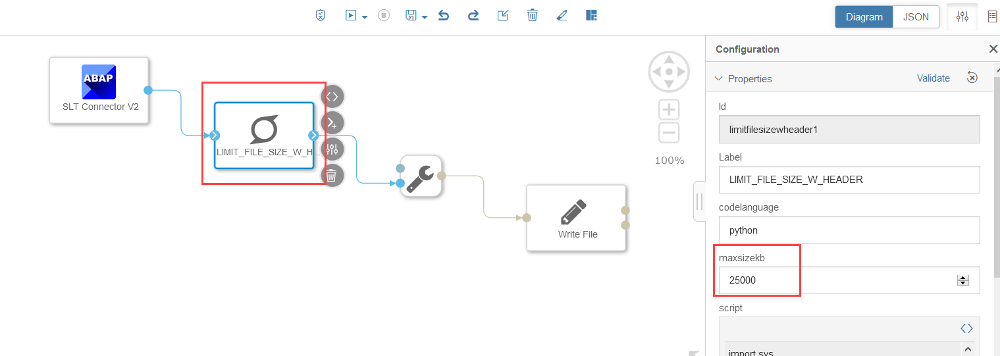

### Tutorial to fetch data in chunks from an SLT Initial load

For a customer scenario, we were supposed to replicate data from Customer **ECC** using ABAP System Landscape Transformation (SLT) Connector to Azure Data Lake Storage (ADLS Gen 2) filesystem using **SAP Data Intelligence Cloud 3.1-2010**.  
The Customer requirement was to have the multiple csv files divided based on particular timestamp (YYYYMMDD_HHMM) and size along with Header Information.  
Currently there is no direct provision in the SAP Data Intelligence SLT Operator to generate multiple csv files based on timestamp (YYYYMMDD_HHMM) and along with headers.

Inspired by SAP blog [SAP Data Intelligence : SLT Replication to Azure Data Lake with file size limit](https://blogs.sap.com/2021/02/19/sap-data-intelligence-slt-replication-to-azure-data-lake-with-file-size-limit/)

##### Creating a custom operator  

    
* Generated the counter based on timestamp (Date:YYYYMMDD and time: HHMM) and file size.
‘cnt’ is in ‘<counter>_<YYYYMMDD>_<HHMM>’ format.
* A seperate folder will be created on each date.
* Counter will get reset every day and starts from 0.
* To simplify and make the code reusable, we created a custom operator extended from base Python operator – where the size limit is a configuration parameter (‘maxsizekb’)
* Refer the link, if you are interested in creating the custom operator: https://help.sap.com/viewer/1c1341f6911f4da5a35b191b40b426c8/Cloud/en-US/049d2f3cc69c4281a3f4570c0d2d066e.html?q=create%20operator
